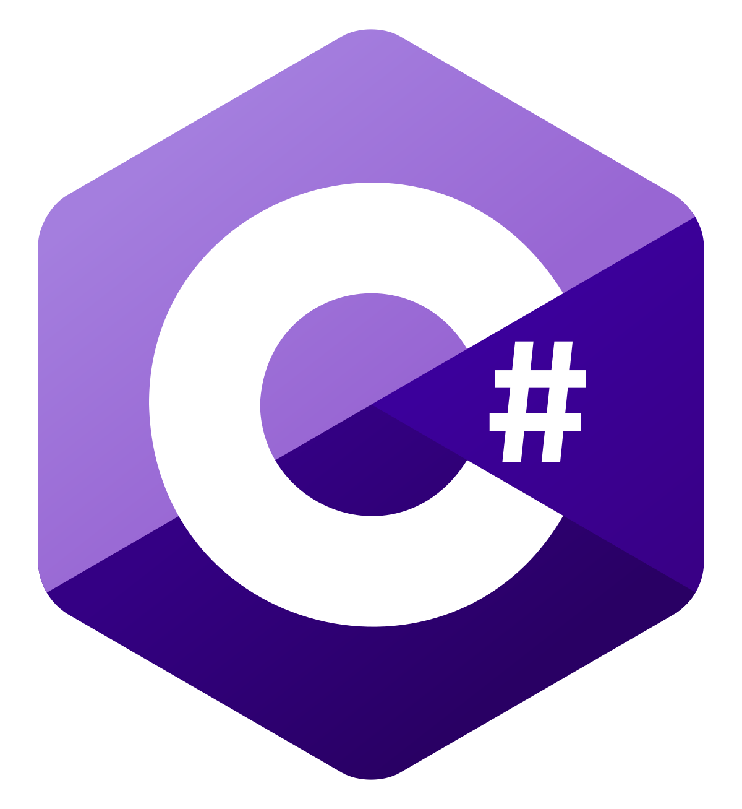
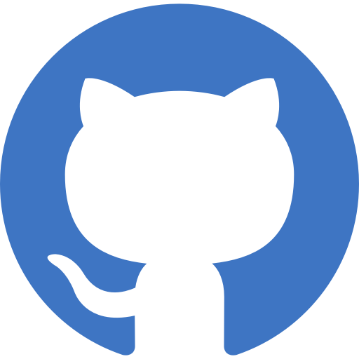

# 
Hi there 👋 My name is Adrian, nickname Adriks ❤️

💻 Full-Stack Developer 💻
❤️ Channel YouTube - Adriks ❤️
🏰 Live in Poland 🏰

  

<pre></pre>

# 
⚔️ Known & Used ⚔️

    

  

 

<pre></pre> 

  

  
  

  

 

<pre></pre>

### Website : https://adriksgames.github.io/  
### Youtube Channel : https://www.youtube.com/channel/UCUyUmVT8Rnzv4mYIyyfwN_w  
### Discord Server : https://discord.gg/g5V8ZJp (Adriks#1421)  

<pre></pre>
